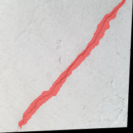
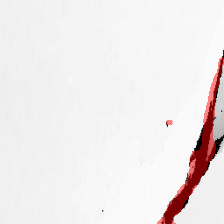
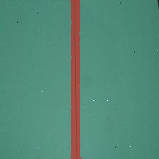

# Text-Conditioned-Image-Segmentation

> Text-conditioned image segmentation for defects (wall cracks and drywall taping seams) using a frozen ViT visual encoder + CLIP text embeddings and a lightweight cross-attention decoder.

## Overview

This repository implements a simple, reproducible pipeline for text-conditioned image segmentation. The model uses:

- A frozen ViT backbone (`timm`'s `vit_base_patch16_224`) to extract visual patch tokens
- A frozen CLIP text encoder (`ViT-B/32`) to produce token-level text features
- A small decoder that performs cross-attention between visual tokens and text tokens and decodes a binary segmentation mask

The implementation includes dataset loading, training, and a simple inference script with overlay visualization.

---

## Features

- Text-conditioned segmentation (prompt-driven)
- Training script with validation & checkpointing (`train.py`)
- Inference script that creates a colored overlay on the image (`predict.py`)
- Utilities to extract/save masks from annotation formats (`utils/extract_mask_*.py`)
- Small, understandable decoder architecture (`model/segmentation_decoder.py`)

---

## Repository structure

- `train.py` — training loop & data loading glue
- `predict.py` — single-image inference and overlay visualization
- `data/dataloader.py` — `CracksAndDrywallDataloader` (expects `images/` and `masks/` folders)
- `model/segmentation_decoder.py` — cross-attention decoder and loss (`BCE + Dice`)
- `utils/` — helpers and prompt lists (`prompts.py`, `misc.py`, mask extractors)
- `checkpoints/` — model checkpoints saved during training
- `results/` — suggested folder for saving result images (create this yourself)

---

## Requirements

Minimum required packages (suggested install):

```bash
pip install torch torchvision timm numpy pillow tqdm openai-clip
```

---

## Dataset format

Dataset must be structured like:

```
/<dataset_root>/
    train/
        images/   (jpg/png images)
        labels/
        masks/    (png masks; same basename as images)
    valid/
        images/
        labels/
        masks/
```

- Masks must be single-channel PNG images (same basename as the image, e.g. `img_001.jpg` has mask `img_001.png`).
- The provided `utils/extract_mask_cracks.py` and `utils/extract_mask_drywall_join.py` can help convert annotation formats (.txt) into binary masks.

Prompts are defined in `utils/prompts.py` and are sampled per-example (some mixing between classes to create harder/ambiguous prompts).

---

## Training

Basic training command:

```bash
python train.py --cracks_path /path/to/cracks_dataset --drywall_path /path/to/drywall_dataset --device cuda --batch_size 32
```

Defaults (change via CLI args):

- `--batch_size` (default 32)
- `--num_epochs` (default 100)
- `--device` (default `cuda`)
- `--learning_rate` (uses AdamW 1e-4)
- Model checkpoints are saved to `checkpoints/segmentation_decoder_epoch_{epoch}.pth` every `--save_interval` (default 10) epochs.

Notes:

- Visual (`timm` ViT) and text (CLIP) backbones are frozen — only the decoder is trained.
- Loss = `BCEWithLogitsLoss` + Dice loss (in `model/segmentation_decoder.py`).

---

## Inference

Run single-image inference like:

```bash
python predict.py --image_path tests/example.jpg --prompt "segment crack" --ckpt checkpoints/segmentation_decoder_epoch_10.pth
```

This will:

- Produce a binary mask (`--output`, default `output_mask.png`) and an overlay image saved as `{output_basename}_overlay.png` (e.g. `output_overlay.png`)
- Print mask statistics (foreground pixel count, unique values) and display the overlay

---

## Model & architecture (brief)

- Visual encoder: `vit_base_patch16_224` → visual tokens with dim 768 (CLS token removed → 196 tokens → 14×14 spatial grid)
- Text encoder: CLIP `ViT-B/32` token-level transformer outputs (token dim 512)
- Decoder:
  - Projects visual (768) and text (512) to a common `input_dim` (512)
  - Multi-head cross-attention (8 heads) between visual tokens (queries) and text tokens (keys/values)
  - Pre-norm MLP residual block, then reshape to 14×14 feature map
  - Convolutional upsampling via ConvTranspose layers: final mask size 224×224
- Loss: BCE with logits + Dice (implemented in `utils/misc.py`)

---

## Results

Below are example results from the `results/` folder — overlay visualizations where the predicted mask is composited in red on the original image.

<table>
  <tr>
    <td align="center" width="33%">
      
      <br>
      <strong>Crack 1</strong>
      <br>
      <em>Prompt: "segment crack" • Overlay of predicted mask (red)</em>
    </td>
    <td align="center" width="33%">
      
      <br>
      <strong>Crack 2</strong>
      <br>
      <em>Prompt: "segment crack" • Overlay of predicted mask (red)</em>
    </td>
    <td align="center" width="33%">
      
      <br>
      <strong>Drywall seam</strong>
      <br>
      <em>Prompt: "segment taping area" • Overlay of predicted mask (red)</em>
    </td>
  </tr>
</table>

<br>
<small>Note: overlay images are expected to be named with the `_overlay` suffix (e.g., `crack_1_overlay.png`). If your files use different names, rename them or update the paths above.</small>
